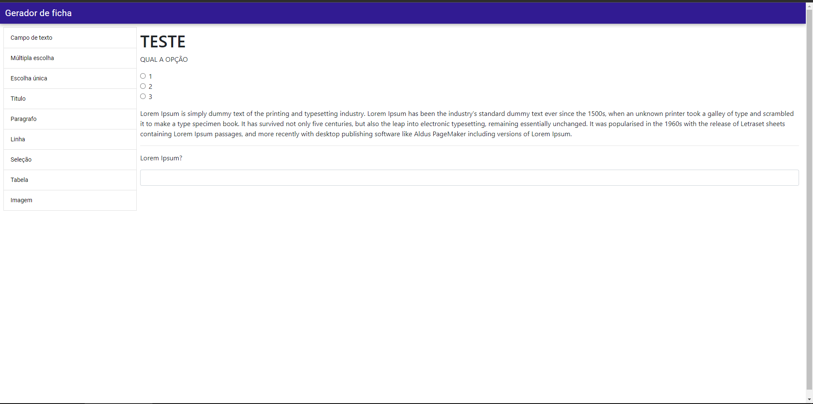

# Gerador de formulário (form-generator)

- projeto criado utilizando quasar framework para gerar formulários básicos com html e bootstrap



## Install the dependencies

```bash
yarn
```

### Start the app in development mode

```bash
quasar dev
```
